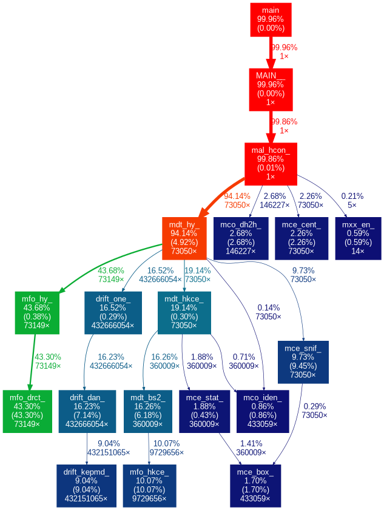

# Moons

This is an unholy combination of shell scripts, text files,
python, and compiled Fortran77 code used to calculate some
gravity stuff for Mercury.  I'm sure Rachel could explain it better.

This project aims to modernize and dockerize the original code
and get it running in a container.

To run the `modern_moon_runner.sh` script that calculates starting points,
and then compiles and runs the Fortran code you will need:

- Docker desktop installed

Then, at the project root, simply bring up the docker container:

```bash
docker compose up
```

#### Fortran execution profile

Running the script with time=3 with a profiler compiled in and using
graphviz to visualize the call graph produced the following diagram.




## Next step notes:

- Make sure all file write outputs write absolute path
- Refactor CopyInfo so it handles the two files seperately
- Write the more sophisticated multi-run script:

### benchmark run notes
- 3 processes 
- pre-generate random data

### actual run notes
- 100? processes
- generate random data every time